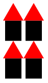

## Introduction

As you may recall from the introduction to algorithms, the ability to
write subroutines is one of the key components of algorithm design.
Subroutines have a _name_ that we use to refer to the subroutine and
zero or more _parameters_ that provide the input to the subroutine.

For example, we might want to define a procedure, `square`, that takes
as input a number and computes the square of that number.

```drracket
> (square 5)
25
> (square 1.5)
2.25
> (square 1/3)
1/9
> (+ (square 1/2) (square 1/3))
13/36
> (square (square 2))
16
```

Of course, `square` can have multiple meanings.  If we're making
drawings, it could also mean "make a square".  Let's consider an
example.

```drracket
> (color-square 10 "red")

> (color-square 5 "blue")

> (above (color-square 12 "red")
         (beside (color-square 8 "blue")
                 (color-square 8 "purple")))

```

The square is a relatively simple example.  Consider, for example, the
following definition of a simple drawing of a house.

```drracket
> (overlay/align "center" "bottom"
                 (overlay/align "left" "center"
                                (circle 3 "solid" "yellow")
                                (rectangle 15 25 "solid" "brown"))
                 (above (triangle 50 "solid" "red")
                        (rectangle 40 50 "solid" "black")))

```

What if we want to make different size or different color houses? We
could copy and paste the code.  However, if we changed our mind about
how to structure our houses, we'd then have to update every copy.
We'd be better off writing a procedure that takes the size and color
as parameters.

```drracket
> (house 50 "black")

> (house 30 "blue")

> (beside (house 30 "blue") (house 30 "green") (house 30 "yellow"))

```

## Defining procedures with `lambda`

Racket provides a variety of mechanisms for defining procedures.
We will start with the most general, which uses the keyword `lambda`.
This mechanism is relatively straightforward.

Typically, we think of a procedure as having three main aspects: The
_name_ we use to refer to the procedure, the names of the _parameters_
(inputs) to the procedure, and the _instructions_ the procedure
executes.

Here is the general form of procedure definitions in Racket, at least as
we will use them in this class.  Racket does not require the indentation,
but it makes it much easier to read and we will require it.

```drracket
(define procedure-name
  (lambda (formal-parameters)
    instructions))
```

You've already seen the `define`; we use `define` to name things.
In this case, we're naming a procedure, rather than a value.  The
_procedure-name_ part is straightforward; it's the name we will use
to refer to the procedure.  The "`lambda`" is a special keyword in
Racket to indicate that "_Hey! This is a procedure!_".  (Lambda has
a special place in the history of mathematical logic and programming
language design and has always meant "function" or "procedure".
It's special enough that the designers of DrRacket chose it for the
icon.)  The _formal-parameters_ are the names that we give to the
inputs.  For example, we might call our input to the `color-square`
procedure `side-length` and `color`. Finally, the _instructions_
are a series of Racket expressions that explain how to do the
associated work.

Let's look at a simple example, that of squaring a number.

```drracket
(define my-square
  (lambda (x)
    (* x x)))
```

Mentally, most Racket programmers read this as something like

> `my-square` names a procedure that takes one input, `x`, and computes
its result by multiplying `x` by itself.

While you will normally define procedures in the definitions pane, you
can also create them in the interactions pane.  Let's see how this
procedure works.

```drracket
> (define my-square
    (lambda (x)
      (* x x)))
> (my-square 5)
25
> (my-square 1/2)
1/4
> (my-square (my-square 2))
16
> my-square
#<procedure:my-square>
```

You may note in the last line that when we asked DrRacket for the
"value" of `my-square`, it told us that it's a procedure named
`my-square`.  Compare that for other values we might define.

```drracket
> (define x 5)
> x
5
> (define phrase "All mimsy were the borogoves")
> phrase
"All mimsy were the borogoves"
> (define red-square (rectangle 15 15 "solid" "red"))
> red-square

> (define multiply *)
> multiply
#<procedure:*>
```

In every case, DrRacket is showing us the _value_ associated with the
name.  In some cases, it's a number.  In some cases, it's a string.  In
some cases, it's an image.  And in some cases, it's a procedure.

How does the procedure we've just defined work?  Here's the easiest way
to think about it: When you call a procedure you've defined with
`lambda`, DrRacket substitutes in the arguments in the procedure call
for the corresponding parameters within the instructions. Next, it
evaluates the updated instructions.

For example, when you call `(my-square 5)`, DrRacket substitutes `5`
for `x` in `(* x x)`, giving `(* 5 5)`.  It then evaluates the
`(* 5 5)`, computing 25.

What about a nested call, such as `(my-square (my-square 2))`?  As
you may recall, Racket evaluates nested expressions from the inside
out.  So, it first computes `(my-square 2)`.  Substituting `2` in
for `x`, it arrives at `(* 2 2)`.  The multiplication gives a value
of `4`.  The `(my-square 2)` is then replaced by `4`.  DrRacket is
then left to evaluate `(my-square 4)`.  This time, it substitutes
`4` in for the `x`, giving it `(* 4 4)`.  It does the multiplication
to arrive at a result of `16`.

We might show the steps as follows, with the `=>` symbol representing
the conversion that happens at each step.

```drracket
(my-square (my-square 2))
=> (my-square (* 2 2))
=> (my-square 4)
=> (* 4 4)
=> 16
```

## Additional examples

You may recall that our second example involved writing a procedure that
makes squares of a specified side length and color.  A square is just a
rectangle with both sides the same size.  So, if we want a procedure to
make squares, we'll just call the `rectangle` procedure, using the same
value for the width and height.

```drracket
(define color-square
  (lambda (side color)
    (rectangle side side "solid" color)))
```

What happens if we call `color-square` on inputs of `15` and `"red"`?
It substitutes `15` for `side` and `"red"` for color, giving us
`(rectangle 15 15 "solid" "red")`.  And, as we saw in the
examples above, that's a red square of side-length 15.

What about the house example?  Let's look at a simpler version, one that
does not include the door.  If we did not care about resizing the house,
we might just write an expression like

```drracket
(above (triangle 50 "solid" "red")
       (rectangle 40 50 "solid" "black"))
```

But we'd like to "parameterize" the code to take the size as an input.
Let's say that the size corresponds to the side-length of the triangle
(or the size of the main body of the house).  We will replace each
`50` by `size` and replace `40` by `(*` `4/5` `size)`.  Let's see how
that works.

```drracket
> (define simple-house
    (lambda (size)
      (above (triangle size "solid" "red")
             (rectangle (* 4/5 size) size "solid" "black"))))
> (simple-house 20)

> (simple-house 30)

```

## Zero-parameter procedures

We've written procedures so that they take an input.  However, there are
also advantages to writing procedures that take no inputs.  In those
cases, a procedure just tells us how to compute a value.  Is that
different than naming just naming the value?  A bit.  Let's explore
those differences.

Consider the following two definitions, each of which creates a series
of houses.

```drracket
> (define house-grid
    (above (beside (simple-house 20) (simple-house 20))
           (beside (simple-house 20) (simple-house 20))))
> (define house-seq
    (lambda ()
      (beside/align "bottom"
                     (simple-house 10) (simple-house 15)
                     (simple-house 20) (simple-house 25))))
```

The first definition, for `house-grid` defines a value.  (It's a value
which is an image, but it's still a value.)  In contrast, the
definition for `house-seq` defines a procedure.  We refer to values and
procedures differently.

```drracket
> house-grid

> house-seq
#<procedure:house-seq>
> (house-seq)

> (house-grid)
application: not a procedure;
 expected a procedure that can be applied to arguments
  given: (object:image% ...)
  arguments...: [none]
```

But the differences go beyond the particular syntax in which we use
them.  When you define a named value, DrRacket evaluates the
instructions immediately and then stores the result.  When you ask for a
named value, DrRacket looks up the value and uses it.  When you ask
DrRacket to evaluate a zero-parameter procedure, it runs the
instructions again.  You can see the effects when we change the
definition of `simple-house`

```drracket
> (define simple-house
    (lambda (size)
      (above (triangle size "solid" "darkred")
             (rectangle (* 4/5 size) size "solid" "gray"))))
> house-grid

> (house-seq)

```

That is, because we'd created `house-grid` while the old version of
`simple-house` was in effect, the image associated with `house-grid`
does not change. However, since the new definition of `simple-house` is
in effect when we _call_ `house-seq`, it uses the new definition and we
get a sequence of houses that use the new definition.

## Some benefits of procedures

As you may have figured out by now, there are many benefits to defining
your own procedures.  One of the most important is _clarity_ or
_readability_.  Another programmer will likely spend less effort
understanding `(simple-house 20)` than they will trying to understand
the more complex `above` expression involving triangles and rectangles.
The first is clearly intended to be a house.  The second could be
anything, at least until you see it.  The other programmer may also find
it easier to _write_ programs using `simple-house` than the much longer
series of expressions.

By using a name for a set of code, we are employing the concept of
_abstraction_.  That is, because the person calling the procedure knows
_what_ the procedure does rather than _how_ it achieves that result, we
have abstracted away some of the details.

There are benefits to abstraction and the use of procedures other than
readability.  For example, it may be that you discover a more efficient
way to do a computation.  If you've written the same code for the
computation throughout your program, you'll have a lot of code to
update.  But if you've created a procedure, you need only update one
place in your code, the place you've defined the procedure.

The `house-seq` example above illustrates a similar point. When we
decide to change the color of the house and the roof, we only had to
make the change in one place, in the definition of `simple-house`.  If
we had, instead, created each house within `house-seq`, we would have
multiple places to update.

As these examples suggest, using procedures to parameterize and name
sections of code provide us with a variety of advantages. First, we can
more easily _reuse_ code in different places. Rather than copying,
pasting, and changing, we can simply call the procedure with new
parameters.  Second, others can more easily _read_ the code we have
written.  Third, we can more easily _update_ the procedures we've
written, either to make them more efficient or to change behavior
universally.

## Self Checks

### Check 1: A simple procedure

Write a procedure, `(subtract2` `val)` that takes a number as input and
subtracts 2 from that number.

```drracket
> (subtract2 5)
3
> (subtract2 3.25)
1.25
> (subtract2 "hello")
-: contract violation
  expected: number?
  given: "hello"
  argument position: 1st
  other arguments...:
   2
```

### Check 2: Exploring steps

Show the steps involved in computing `(square (subtract2 5))` and
`(subtract2 (square 5))`.

## Acknowledgements

This section draws upon [a reading entitled "Defining your own
procedures"](https://www.cs.grinnell.edu/~rebelsky/Courses/CSC151/2018S/readings/procedures)
and [an earlier reading entitled "Writing your own
procedures"](https://www.cs.grinnell.edu/~rebelsky/Courses/CSC151/2017S/readings/procedures-rgb-reading.html)
from Grinnell College's CSC 151.

The house drawing was inspired by a more sophisticated house drawing
from the [Racket Image
Guide](https://docs.racket-lang.org/teachpack/2htdpimage-guide.html).
